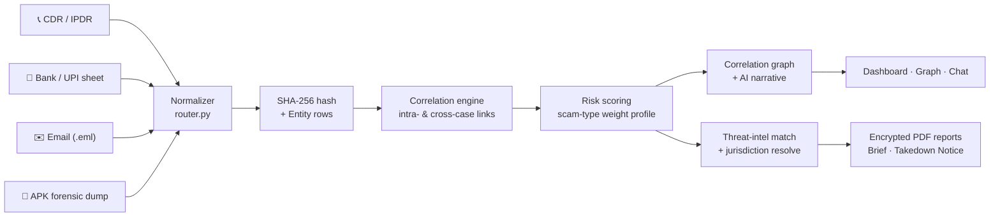
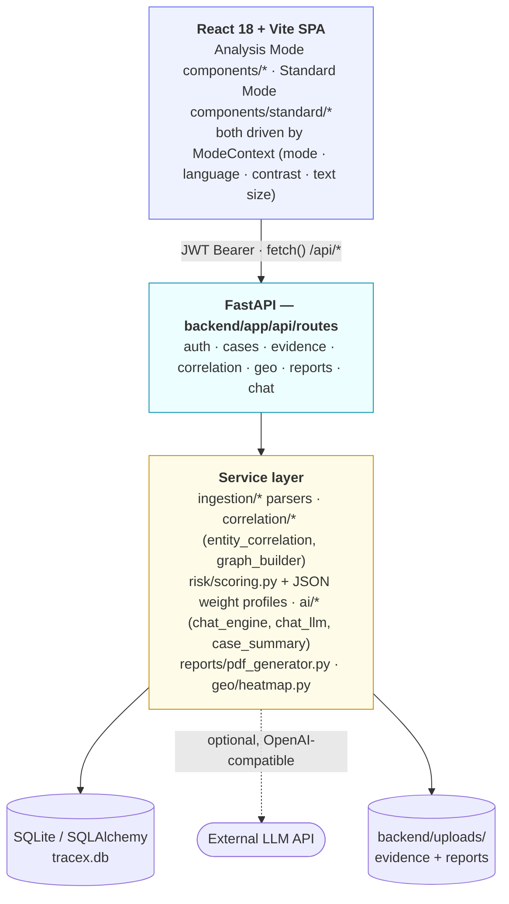
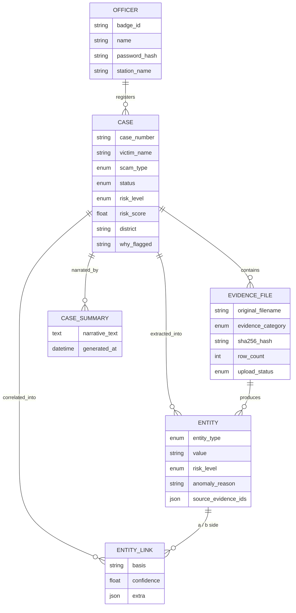

<div align="center">


# TraceX

### Cyber Fraud Operations Room

**Evidence ingestion → entity correlation → risk scoring → network graph → court-ready reports — in one console.**

Built for Indian Cyber Cell investigating officers to turn scattered CDRs, bank/UPI trails, phishing
infrastructure and malicious-APK dumps into a single correlated case, in minutes instead of days.

[](backend/requirements.txt)
[](backend/app/main.py)
[](frontend/package.json)
[](frontend/vite.config.js)
[](frontend/tailwind.config.js)
[](backend/app/db/models.py)
[](backend/tests)
[](LICENSE)

<sub>Two full interfaces on one codebase — a live SOC-style **Analysis Mode** and a formal
**Standard Mode** government portal skin, switchable per officer, with zero duplicated data.</sub>

</div>

<br />

<table>
<tr>
<td width="50%">

<p align="center"><sub><b>Analysis Mode</b> — Operations Dashboard</sub></p>
</td>
<td width="50%">

<p align="center"><sub><b>Standard Mode</b> — Case Management Dashboard</sub></p>
</td>
</tr>
<tr>
<td width="50%">

<p align="center"><sub>Multi-hop <b>Correlation Graph</b> with live risk clustering</sub></p>
</td>
<td width="50%">

<p align="center"><sub>The same graph, rendered as formal case registers</sub></p>
</td>
</tr>
</table>

<br />

## Contents

- [Why TraceX](#why-tracex)
- [Feature tour](#feature-tour)
- [How a case moves through the system](#how-a-case-moves-through-the-system)
- [Architecture](#architecture)
- [Data model](#data-model)
- [Two UIs, one truth: Analysis Mode vs. Standard Mode](#two-uis-one-truth-analysis-mode-vs-standard-mode)
- [Tech stack](#tech-stack)
- [Getting started](#getting-started)
- [Running the demo](#running-the-demo-5-minutes)
- [API reference](#api-reference)
- [Project layout](#project-layout)
- [Testing](#testing)
- [Security notes](#security-notes)
- [Roadmap](#roadmap)
- [License](#license)

<br />

## Why TraceX

A single cyber-fraud complaint rarely stands alone. The same mule account, UPI handle or IMEI often
threads through a dozen other complaints — but that pattern is invisible when every case lives in its
own spreadsheet. TraceX exists to make that pattern visible **the moment evidence is uploaded**, and to
turn it into something a court will accept:

- **One victim's CDR + bank statement in** → **a scored, cross-matched, graph-visualised case out.**
- Every fact an officer sees — risk score, "why flagged", entity list, PDF — is derived from the same
  evidence rows and the same deterministic engine. Nothing is hand-typed twice.
- Runs **fully offline** by default (SQLite + bundled threat-intel CSVs); an LLM is an optional layer
  on top, never a dependency.

<br />

## Feature tour

<details open>
<summary><b>🗂️ Multi-source evidence ingestion</b></summary>

<br />

Four purpose-built parsers turn raw artifacts into a common entity schema — no manual tagging:

| Source | Parser | Extracts |
|---|---|---|
| Telecom CDR / IPDR (`.csv`, `.xlsx`) | `telecom_parser.py` | Phone numbers, IMEI, IMSI, IP addresses |
| Bank / UPI settlement sheets | `bank_parser.py` | Bank accounts, UPI handles (+ amount, IFSC in metadata) |
| Email (`.eml`) | `email_parser.py` | Sender/recipient addresses, embedded URLs, originating IPs |
| Android forensic dump (`.json`) | `apk_parser.py` | IMEI, C2 server, contacted IPs, flagged permissions (`SMS`, `ACCESSIBILITY`, `CALL_LOG`) |

Every file is content-addressed on arrival: **SHA-256 is computed and stored at upload time**, so any
later tampering is instantly detectable — the same hash is re-stamped onto every PDF report generated
from that evidence.

Row-level provenance is preserved (`row_index` on every extracted entity), so correlation only links
values that **actually co-occurred on the same call / transaction row** — not just anywhere in the same
file.

</details>

<details open>
<summary><b>🕸️ Deterministic, explainable entity correlation</b></summary>

<br />

`services/correlation/entity_correlation.py` links entities using **investigative rules, not a black
box** — every edge carries a human-readable `basis` and a fixed confidence weight:

| Signal | Confidence | Basis |
|---|---|---|
| Shared UPI handle | 0.95 | `shared_upi_handle` |
| Shared bank account | 0.95 | `shared_account` |
| Shared phone number | 0.90 | `shared_phone` |
| Shared email | 0.85 | `shared_email` |
| Shared URL / domain | 0.75 | `shared_url` |
| Shared IP address | 0.70 | `shared_ip_address` |
| Shared IMEI / IMSI | 0.60 | `shared_imei` / `shared_imsi` |
| Same `/24` IP subnet (different hosts) | 0.40 | `shared_ip_subnet` |

Correlation also runs **across every other open case** in the database — a UPI handle reused in three
complaints is surfaced as a cross-case link with a +15 risk-score escalation and a direct pointer to the
matched case number, turning isolated complaints into a visible syndicate.

</details>

<details open>
<summary><b>⚖️ Configuration-driven risk scoring</b></summary>

<br />

Risk isn't one formula — it's a **per-scam-type weight profile**, loaded from JSON and fully
swappable without touching code:

```jsonc
// services/risk/profiles/digital_scam.json
{
  "multi_hop_speed":    0.35,   // rapid mule-account/UPI hand-offs
  "shared_upi_handle":  0.30,
  "shared_account":     0.20,
  "shared_ip":          0.15
}
```

`malicious_apk.json` instead weights `high_risk_permissions` and `known_c2_server`;
`phishing_vishing.json` weights `spoofed_caller_pattern` and `high_call_velocity`. The engine computes a
weighted 0–100 score, maps it to **Low / Medium / High**, and writes back a plain-English
**"why flagged"** rationale (e.g. *"Multi-hop routing: 12 mule accounts/UPI handles in rapid
succession"*) that appears everywhere the case is referenced — dashboard, graph, PDF.

</details>

<details open>
<summary><b>🌐 Interactive multi-hop correlation graph</b></summary>

<br />

A hand-built, dependency-free SVG force layout (`NetworkGraph.jsx`) renders every entity as a
risk-coloured node and every link as a confidence-weighted edge:

- **Category clustering** — phones, accounts, UPI handles, IMEI/devices, IPs, emails and URLs each
  orbit their own ring around the case centre, so the shape of the fraud is legible at a glance.
- **1-hop / 2-hop / 3-hop / overview filters** to progressively expand the blast radius from the
  victim outward.
- Click any cluster for a side panel of its **top entities and risk distribution**; click any node for
  its direct connections and the evidence that produced them.
- **Cross-case edges** are visually distinct and link straight through to the other investigation.

</details>

<details open>
<summary><b>🤖 AI case narrative + grounded chat assistant</b></summary>

<br />

- **Case narrative** (`services/ai/case_summary.py`) — a structured prompt built from the *actual*
  graph (entities, edges, risk factors) is handed to an LLM to produce a plain-language investigative
  brief and an immediate action recommendation (e.g. *"issue a Section 91 CrPC freeze on UPI handle
  X"*). Falls back to a clear deterministic narrative if no LLM is configured.
- **Chat assistant** (`services/ai/chat_engine.py`) — ask about a case, compare two cases, or ask
  portfolio questions ("how many high-risk cases are open?", "which cases share entities?"). Intent is
  resolved with pattern matching against the live database first, so the answer is **always grounded**
  in real case data; an LLM only rephrases that grounded context when configured — it is never allowed
  to invent case numbers, amounts or identifiers.
- **100% optional** — leave `AI_SUMMARY_API_KEY` unset and every one of these features keeps working,
  answering directly from case data instead.

</details>

<details open>
<summary><b>🛰️ Threat-intel matching &amp; jurisdiction heatmap</b></summary>

<br />

- Bundled, offline CSV feeds (`data/threat_intel/`) of known-malicious URLs and APK SHA-256 hashes are
  cross-matched against every case's entities and uploaded files at report time.
- District is resolved automatically from IFSC codes and PIN codes found in evidence
  (`services/geo/lookups/*.csv` — no external geocoding API), and the dashboard renders a live
  **fraud-density heatmap** across jurisdictions, click-to-filter into the priority queue.

</details>

<details open>
<summary><b>📄 Court-ready, tamper-evident PDF reports</b></summary>

<br />

Two report types, generated server-side (ReportLab, with a WeasyPrint HTML path available) and
delivered **password-protected**:

| Report | Legal basis | Contents |
|---|---|---|
| **Investigative Brief Dossier** | Section 65B, Indian Evidence Act | Executive summary, entity landscape, correlation matrix, case timeline, Section 91 CrPC freeze directives |
| **Statutory Takedown Notice** | Section 69A, IT Act | Matched malicious infrastructure, 24-hour compliance mandate, Section 67C log-preservation order |

Every generated PDF is **stamped with its own SHA-256** (returned in an `X-Document-SHA256` header) so
the exact artefact handed to a court can be verified byte-for-byte later.

</details>

<details open>
<summary><b>🏛️ Two interfaces, one dataset — Analysis Mode &amp; Standard Mode</b></summary>

<br />

Every officer can switch, per session, between:

- **Analysis Mode** — a dark, high-density SOC console: glassmorphism panels, glow accents, an
  animated graph, built for an officer actively working a case.
- **Standard Mode** *(beta)* — a light, formal **e-governance portal** skin: an emblem header, tabular
  case/entity/connection registers, a statutory footer, bilingual (English/Hindi) labels, adjustable
  text size and a high-contrast mode — built to be shown to a senior officer, in a courtroom, or on a
  government network that expects a government-portal look.

Both modes render **the exact same API data** through mode-specific presentational components — no
duplicated business logic, no second backend.

</details>

<br />

## How a case moves through the system



<br />

## Architecture



<br />

## Data model



<br />

## Two UIs, one truth: Analysis Mode vs. Standard Mode

| | Analysis Mode | Standard Mode *(beta)* |
|---|---|---|
| **Look** | Dark SOC console, glow accents, glassmorphism | Light, formal e-governance portal |
| **Data layout** | Card- and graph-heavy | Dense, sortable registers/tables |
| **Header** | Live status bar, AI chat launcher | Emblem, department name, "Government of [X]" bar |
| **Navigation** | Icon tabs | Breadcrumbs + top navbar |
| **Accessibility** | — | Text-size control, high-contrast toggle, bilingual (EN/HI) |
| **Footer** | — | Statutory references, helplines, disclaimer |
| **Backing data** | Same `/api/*` endpoints | Same `/api/*` endpoints |

Switch anytime from the toggle in the top bar — the choice is remembered per browser
(`localStorage`), and nothing about a case changes when you do.

<p align="center">
  
  <br /><sub>Standard Mode's officer sign-in screen</sub>
</p>

<br />

## Tech stack

<table>
<tr><td valign="top" width="50%">

**Backend**
- **FastAPI** + **Uvicorn** — async REST API
- **SQLAlchemy** — ORM (SQLite by default, swappable via `DATABASE_URL`)
- **Pydantic v2** — request/response schemas & settings
- **python-jose** + **passlib[bcrypt]** — JWT auth, hashed passwords
- **pandas / openpyxl** — CDR & bank/UPI spreadsheet parsing
- **ReportLab** (+ optional **WeasyPrint**) — PDF report generation
- **httpx** — outbound calls to an OpenAI-compatible LLM endpoint
- **pytest** — 44 tests across auth, correlation, risk, reports, geo, chat, ingestion

</td><td valign="top" width="50%">

**Frontend**
- **React 18** + **React Router 6**
- **Vite 5** — dev server & build
- **Tailwind CSS 3** — design-token-driven theming for *both* UI modes
- **lucide-react** — icon set
- Hand-rolled **SVG force-graph** — zero graph-charting dependency
- `ModeContext` — mode / language / contrast / font-scale state, synced to `<html data-mode>`

</td></tr>
</table>

<br />

## Getting started

### Prerequisites

- Python 3.11+
- Node.js 18+

### Backend

```bash
cd backend
python -m venv venv && source venv/bin/activate   # Windows: venv\Scripts\activate
pip install -r requirements.txt
cp .env.example .env
uvicorn app.main:app --reload
```

The API starts at `http://localhost:8000`. On first launch it auto-seeds one officer
(`MP-IO-4471` / `demo1234`) and four fully-correlated demo cases spanning every scam type and risk tier.

<details>
<summary><b>Enable the AI layer (optional)</b></summary>

<br />

Everything works fully offline out of the box. To let an LLM phrase the chat assistant's answers and
case narratives (using the same grounded case data — it never invents facts), set in `backend/.env`:

```env
AI_SUMMARY_API_KEY=sk-...
AI_SUMMARY_API_URL=https://api.openai.com/v1/chat/completions
AI_SUMMARY_MODEL=gpt-4o-mini
AI_CHAT_TIMEOUT_SECONDS=15
```

Any OpenAI-compatible chat-completions endpoint works. If the call is slow, rate-limited or
unreachable, the assistant transparently falls back to its data-driven answer.

</details>

### Frontend

```bash
cd frontend
cp .env.example .env
npm install
npm run dev
```

Open `http://localhost:5173` and sign in with the seeded credentials above.

<br />

## Running the demo (5 minutes)

1. **Home** — see the live priority queue: urgent-action banner, four seeded cases ranked by risk
   score, the evidence pipeline, and the jurisdictional heatmap.
2. **+ New investigation** — enter a victim name, pick **Digital Scam**, and upload the sample evidence
   from `backend/data/sample/`: `mock_cdr.csv` → Telecom, `mock_bank_upi.xlsx` → Bank/UPI,
   `mock_apk_dump.json` + `mock_email.eml` → Other. Watch each file hash, parse and index live.
3. **Find connections & view graph** — correlation and scam-type-aware risk scoring run automatically;
   you land on the interactive graph. Filter by hop distance, inspect a cluster, read the AI case
   narrative.
4. **Reports** — generate the encrypted **Investigative Brief** and **Takedown Notice** PDFs, each
   stamped with a verifiable SHA-256.
5. Flip the **Standard / Analysis** toggle in the top bar at any point — same case, new skin.

<br />

## API reference

All routes below are mounted under `/api` and (except `/api/auth/login`) require
`Authorization: Bearer <JWT>`.

<details>
<summary><b>Expand full endpoint list</b></summary>

<br />

| Method | Endpoint | Purpose |
|---|---|---|
| `POST` | `/auth/login` | Authenticate with badge ID + password → JWT |
| `GET` | `/auth/me` | Current officer profile |
| `POST` | `/cases` | Register a new case |
| `GET` | `/cases` | List all cases (risk-ranked) |
| `GET` | `/cases/{id}` | Full case detail |
| `GET` | `/cases/summary-stats` | Dashboard counters (high-risk, active, awaiting, closed) |
| `POST` | `/cases/{id}/evidence` | Upload an evidence file (multipart) |
| `GET` | `/cases/{id}/evidence` | List a case's evidence files |
| `GET` | `/evidence/unprocessed` | Global evidence-processing tray |
| `POST` | `/cases/{id}/correlate` | Run entity correlation + risk scoring |
| `GET` | `/cases/{id}/graph` | Node/edge graph for the correlation view |
| `GET` | `/cases/{id}/entities/top-risk` | Highest-risk entities for a case |
| `GET` | `/cases/{id}/summary` | Latest AI/deterministic case narrative |
| `POST` | `/cases/{id}/summary/regenerate` | Force-regenerate the narrative |
| `GET` | `/geo/heatmap` | District-wise fraud density |
| `POST` | `/cases/{id}/reports/investigative-brief` | Generate the encrypted Brief PDF |
| `POST` | `/cases/{id}/reports/takedown-request` | Generate the encrypted Takedown Notice PDF |
| `GET` | `/cases/{id}/reports/takedown-matches` | Threat-intel matches feeding the takedown notice |
| `GET` | `/cases/{id}/reports/preview` | Report data preview (no PDF render) |
| `POST` | `/chat` | Ask the grounded chat assistant (case-scoped or portfolio-wide) |

</details>

<br />

## Project layout

```
tracex/
├── backend/
│   ├── app/
│   │   ├── api/routes/        # auth · cases · evidence · correlation · geo · reports · chat
│   │   ├── services/
│   │   │   ├── ingestion/     # telecom · bank/UPI · email · APK parsers + router
│   │   │   ├── correlation/   # entity_correlation.py · graph_builder.py
│   │   │   ├── risk/          # scoring.py + per-scam-type weight profiles (JSON)
│   │   │   ├── geo/           # district heatmap + offline IFSC/PIN lookups
│   │   │   ├── ai/            # chat_engine · chat_llm · case_summary
│   │   │   └── reports/       # pdf_generator.py (Brief + Takedown Notice)
│   │   ├── db/                # models.py · seed.py · seed_demo.py
│   │   └── core/              # config (Settings) · security (JWT/bcrypt)
│   ├── data/
│   │   ├── sample/            # demo evidence files used by the walkthrough
│   │   └── threat_intel/      # bundled known-bad-URL / known-APK-hash CSVs
│   └── tests/                 # 44 pytest tests
└── frontend/
    └── src/
        ├── components/        # Analysis Mode UI
        │   └── standard/      # Standard Mode UI (parallel component tree)
        ├── pages/              # Home · ConnectionsGraph · Reports · Login
        ├── context/            # ModeContext (mode/theme/a11y state)
        ├── config/             # Standard Mode copy & placeholder identity
        └── styles/             # tokens.css (Analysis) · standard-mode.css
```

<br />

## Testing

```bash
cd backend
pytest -q
```

44 tests cover authentication, entity correlation (including cross-case linking), risk-profile scoring,
evidence ingestion, PDF report generation, geo heatmap resolution, and the chat assistant's intent
routing and LLM fallback behaviour.

<br />

## Security notes

- Passwords are **bcrypt-hashed**; sessions are stateless **JWTs** (`JWT_SECRET`, configurable expiry).
- Every uploaded filename is sanitised against path traversal before it touches disk.
- Every evidence file and every generated report PDF is **SHA-256 hashed** for chain-of-custody
  integrity — verify what a court receives against what was actually ingested.
- The bundled chat/LLM system prompt is explicitly instructed to treat evidence content as **data,
  never as instructions**, and to answer only from supplied case context.
- Set a strong `JWT_SECRET` before any non-local deployment — the shipped default is for local dev only.

<br />

## Roadmap

- [ ] Postgres-first deployment profile for managed hosting
- [ ] Automated / scheduled correlation sweeps across the full case portfolio
- [ ] Richer courtroom timeline export
- [ ] Role-based access beyond a single officer table

<br />

## License

[MIT](LICENSE) © 2026 Krishna Prajapat

<div align="center">
<sub>TraceX is an investigative decision-support tool. Risk scores, correlation links and AI-generated
narratives are advisory — the Investigating Officer verifies and decides.</sub>
</div>
