<div align="center">

<a href="#see-it-live">

</a>


### One victim's evidence in. A scored, cross-matched, court-ready case out.

<a href="https://readme-typing-svg.demolab.com">
  
</a>

<br/>

[](https://tracex-frontend-3.onrender.com)
[](https://tracex-backend-3.onrender.com)

<sub>🕐 Free-tier hosting — the badges above are checked live on every page load. If a service shows <b>waking up</b>, give it ~30–50s and refresh; a <a href="#see-it-live">keep-alive workflow</a> pings it every 10 minutes to minimize this.</sub>

<br/><br/>

[](backend/requirements.txt)
[](backend/app/main.py)
[](frontend/package.json)
[](frontend/vite.config.js)
[](frontend/tailwind.config.js)
[](backend/app/db/models.py)
[](backend/tests)
[](LICENSE)

[](https://github.com/Krishnaa-21/tracex/commits)
[](https://github.com/Krishnaa-21/tracex)
[](https://github.com/Krishnaa-21/tracex/issues)
[](https://github.com/Krishnaa-21/tracex/stargazers)

**[🚀 Try the live demo](https://tracex-frontend-3.onrender.com)** · **[📖 Jump to setup](#-getting-started)** · **[🤖 Meet the AI agents](#-the-ai-agents-an-investigation-team-that-never-sleeps)** · **[🌐 See both UIs](#-one-backend-two-worlds)**

</div>

<br/>

<table align="center">
<tr>
<td width="50%">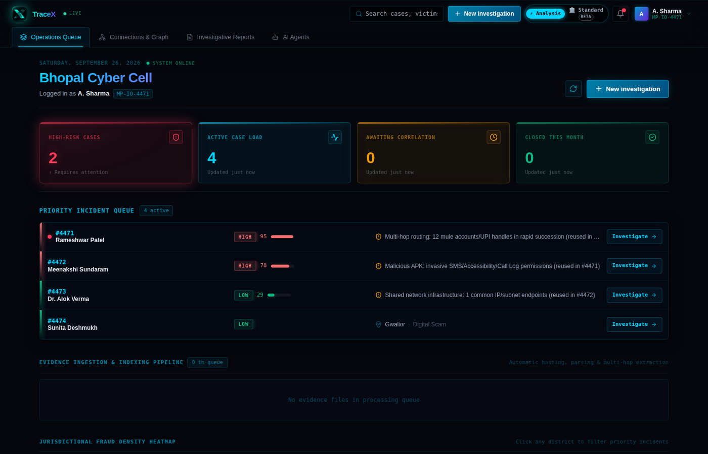</td>
<td width="50%">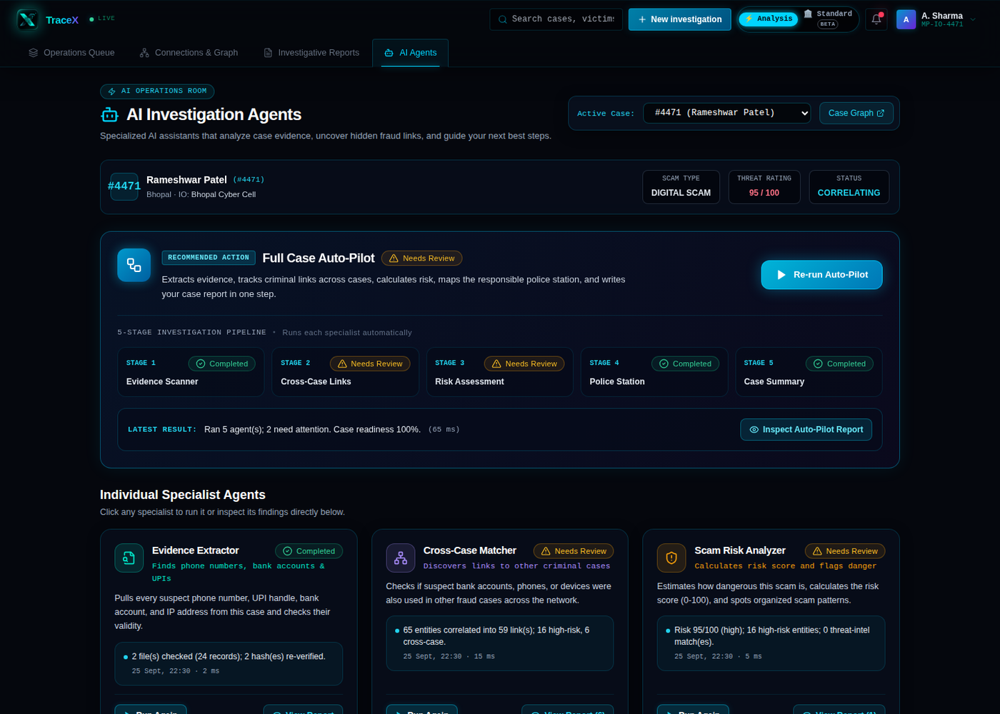</td>
</tr>
<tr>
<td align="center"><sub><b>Analysis Mode</b> — live SOC-style operations dashboard</sub></td>
<td align="center"><sub><b>AI Agents</b> — the Full Case Auto-Pilot, mid-run</sub></td>
</tr>
</table>

<br/>

---

## ⚡ The 60-second pitch

TraceX is a cyber-fraud case management console, built for Indian Cyber Cell officers, that turns raw
evidence into a correlated, risk-scored, court-ready investigation — **before the officer finishes their
coffee.**

```
  1 CDR + 1 bank statement + 1 APK dump
                    │
                    ▼
   automatic parsing → SHA-256 hashing → entity extraction
                    │
                    ▼
   correlation across THIS case AND every other open case
                    │
                    ▼
   risk-scored · graphed · narrated by AI · ready to file
```

- 🧩 **4 evidence parsers** turn CDRs, bank/UPI sheets, emails and APK dumps into one entity schema
- 🕸️ **A deterministic correlation engine** links entities with a human-readable reason and confidence score — never a black box
- 🤖 **6 AI agents** (one orchestrator + five specialists) audit, correlate, score, localise and report — one click, fully logged
- 🏛️ **Two complete UIs on one backend** — a dark SOC console and a formal government-portal skin, same data, zero duplication
- 📄 **Court-ready PDF exports**, password-protected and SHA-256 stamped, citing Sections 65B, 69A and 91 CrPC
- 🔌 **Fully offline-capable** — SQLite + bundled threat-intel CSVs. An LLM is an *optional* layer, never a dependency

<br/>

## 📚 Table of contents

<table>
<tr>
<td valign="top" width="33%">

**The story**
- [Why TraceX exists](#-a-monday-morning-in-bhopal-cyber-cell)
- [See it live](#see-it-live)
- [Screenshot gallery](#-screenshot-gallery)

**How it works**
- [The investigation pipeline](#-the-investigation-pipeline)
- [The AI Agents](#-the-ai-agents-an-investigation-team-that-never-sleeps)
- [Architecture](#-architecture)
- [Data model](#-data-model)

</td>
<td valign="top" width="33%">

**[Feature tour](#-feature-tour)**
- Evidence ingestion
- Correlation engine
- Risk scoring
- Correlation graph
- AI narrative + chat
- Threat intel + geo
- PDF reports
- [Two UIs](#-one-backend-two-worlds)

</td>
<td valign="top" width="33%">

**Build it yourself**
- [Tech stack](#-tech-stack)
- [Getting started](#-getting-started)
- [5-minute demo](#-run-your-own-5-minute-demo)
- [API reference](#-api-reference)
- [Project layout](#-project-layout)
- [Testing](#-testing)
- [Security notes](#-security-notes)
- [Roadmap & credits](#-roadmap)

</td>
</tr>
</table>

<br/>

---

## 🌅 A Monday morning in Bhopal Cyber Cell

A new complaint lands: ₹40,000 gone through a "task-based investment" app. On its own, it's one more
case in a queue of 200.

Officer Sharma uploads the victim's bank statement and call records. TraceX hashes both files, extracts
a UPI handle, three phone numbers and an IP address — and in the same breath, checks them against
**every other open case in the database.**

The UPI handle has been seen before. Twice. Same handle, two other victims, two other officers, filed
three weeks apart. What looked like an isolated ₹40,000 complaint is actually node #3 in a
syndicate — and TraceX surfaced it automatically, with a confidence score and the exact evidence row
that proves the link.

That's the entire premise of this project: **a pattern that's invisible across spreadsheets should be
obvious the moment evidence is uploaded.** Everything below — the correlation engine, the risk scoring,
the AI agents, the two interfaces — exists to make that true, and to make it something a court will
accept.

<br/>

## See it live

No install required — the app is deployed and awake (or waking up):

<div align="center">

| | |
|---|---|
| 🌐 **App** | **[tracex-frontend-3.onrender.com](https://tracex-frontend-3.onrender.com)** |
| 🔧 **API** | [tracex-backend-3.onrender.com](https://tracex-backend-3.onrender.com) |
| 🪪 **Badge ID** | `MP-IO-4471` |
| 🔑 **Password** | `demo1234` |

</div>

> **Free-tier note:** both services live on Render's free tier and sleep after 15 minutes of no traffic.
> A [`keep-alive` GitHub Action](.github/workflows/keep-alive.yml) pings the backend every 10 minutes, but
> a cold visit can still take ~30–50 seconds to wake up. The live-status badges at the top of this page
> reflect the *current* state — refresh if you see "waking up."

Once in, sign in with the credentials above and you'll land in a pre-seeded world: 4 fully-correlated
demo cases (`#4471`–`#4474`) spanning every scam type and risk tier, ready to explore — or follow the
[5-minute walkthrough](#-run-your-own-5-minute-demo) below to build one from scratch.

<br/>

## 📸 Screenshot gallery

<details open>
<summary><b>Click to browse both interfaces</b></summary>

<br/>

<table>
<tr><td align="center" colspan="2"><b>🌃 Analysis Mode</b> — dark, high-density SOC console</td></tr>
<tr>
<td width="50%"></td>
<td width="50%">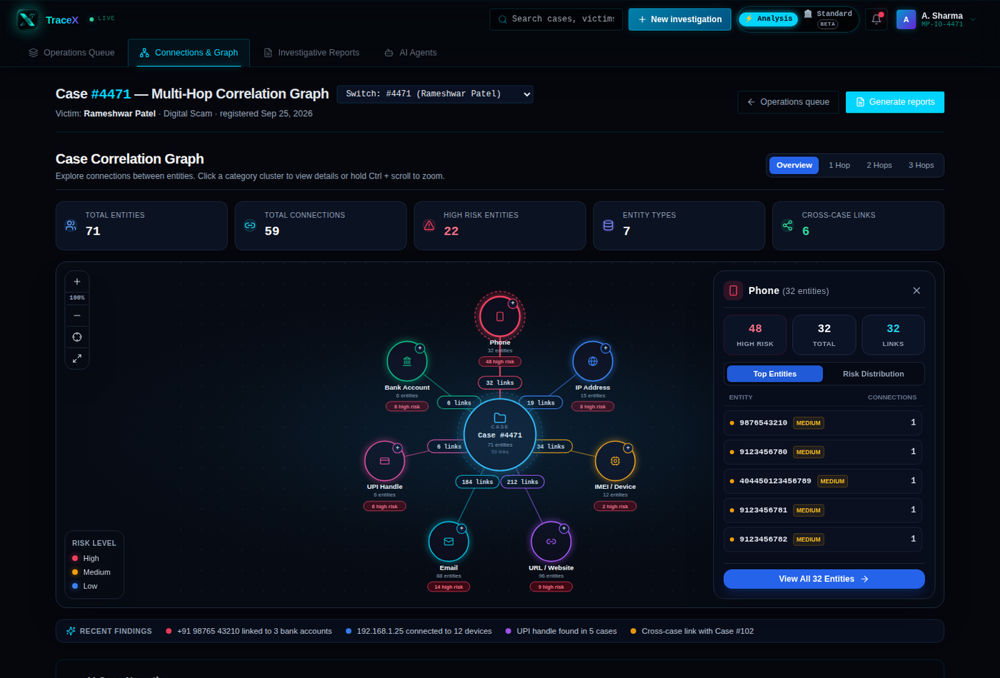</td>
</tr>
<tr>
<td align="center"><sub>Operations dashboard — priority queue, heatmap, live pipeline</sub></td>
<td align="center"><sub>Multi-hop correlation graph with risk clustering</sub></td>
</tr>
<tr><td align="center" colspan="2"><b>🏛️ Standard Mode</b> <i>(beta)</i> — formal e-governance portal skin</td></tr>
<tr>
<td width="50%">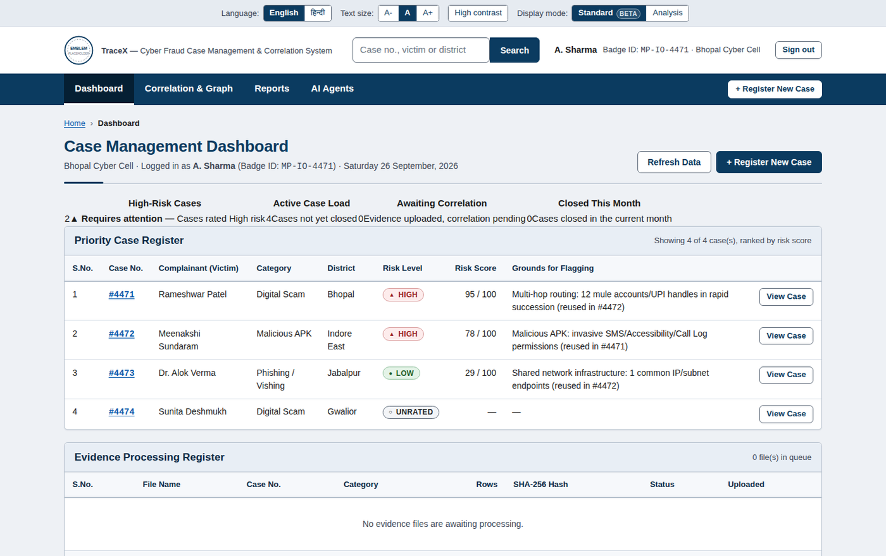</td>
<td width="50%">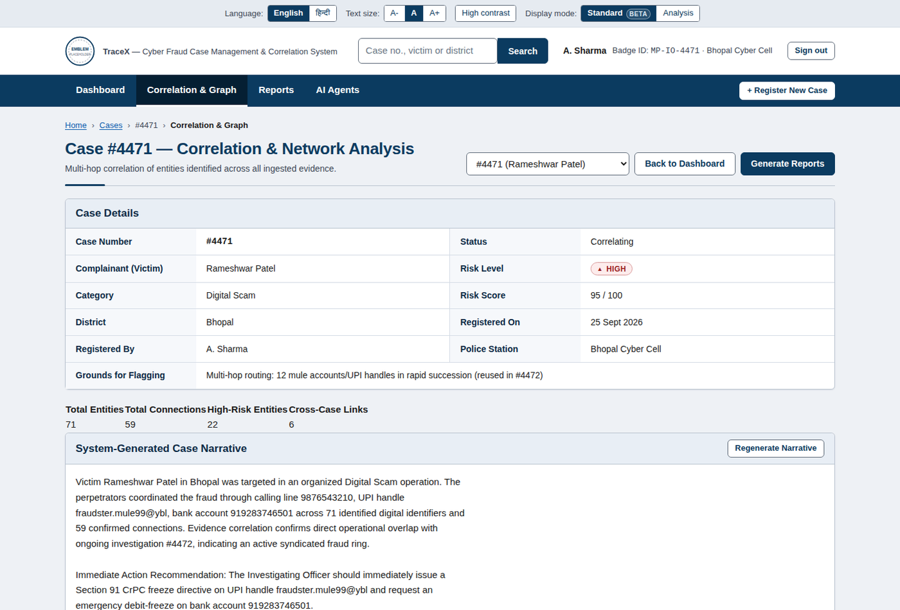</td>
</tr>
<tr>
<td align="center"><sub>Case register — same data, formal tabular layout</sub></td>
<td align="center"><sub>Correlation & network analysis as case registers</sub></td>
</tr>
<tr><td align="center" colspan="2"><b>🤖 AI Agents</b> — identical control room, both skins</td></tr>
<tr>
<td width="50%"></td>
<td width="50%">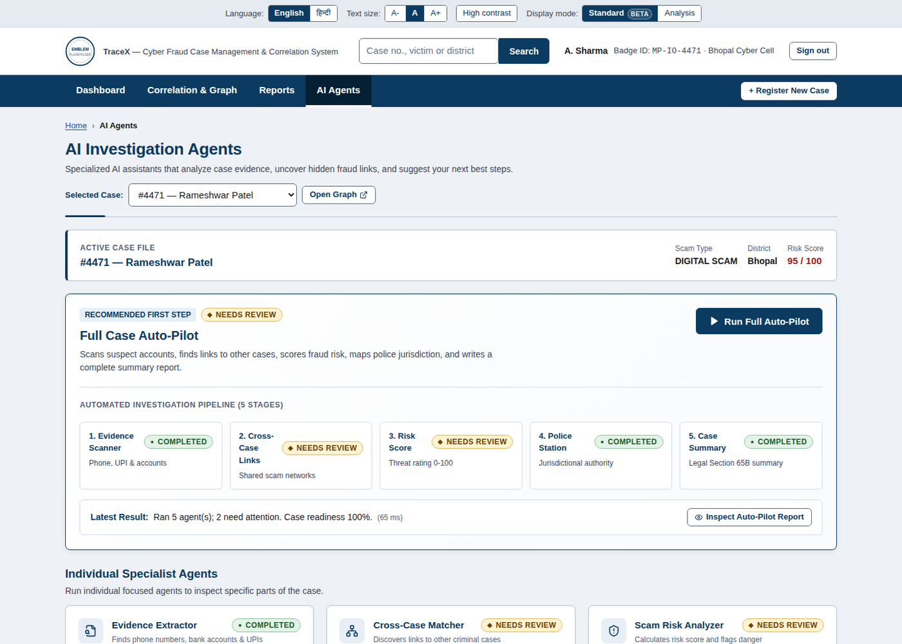</td>
</tr>
<tr>
<td align="center"><sub>Full Case Auto-Pilot, mid-pipeline</sub></td>
<td align="center"><sub>Same six agents, government-register styling</sub></td>
</tr>
<tr><td align="center" colspan="2"><b>🔐 Officer Sign-In</b></td></tr>
<tr><td colspan="2">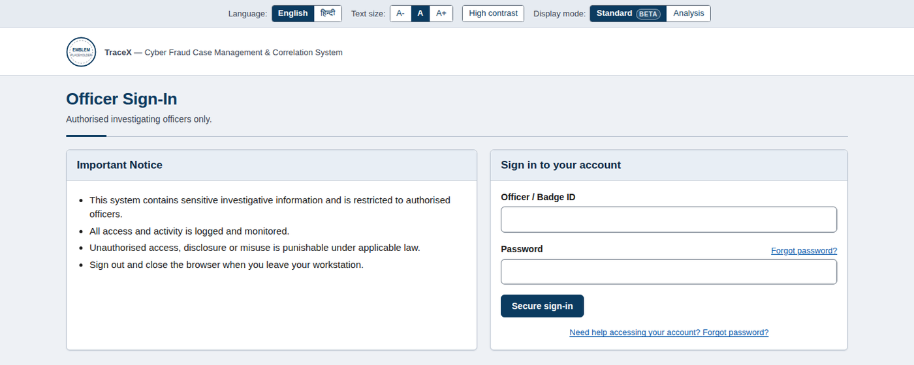</td></tr>
</table>

</details>

<br/>

---

## 🔬 The investigation pipeline

Every case moves through the same deterministic path, whether it's built by hand or by the AI agents:

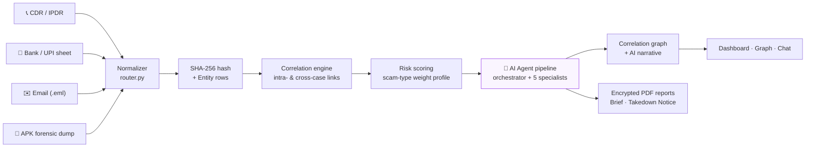

<br/>

## 🤖 The AI Agents: an investigation team that never sleeps

The newest (and most ambitious) part of TraceX: six purpose-built agents that do the first pass of
investigative work an officer would otherwise do manually — each one auditable, each one logged. Click
**Full Case Auto-Pilot** and watch all five specialists run in sequence, or run any one on its own.

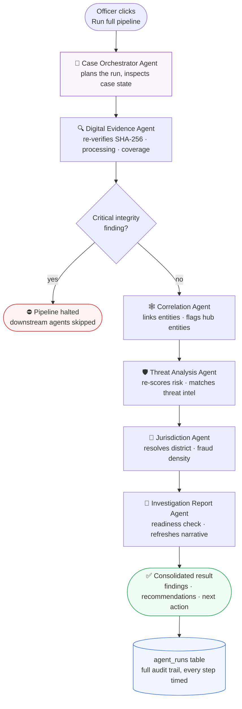

Notice the halt logic in the middle: if the **Digital Evidence Agent** finds a critical integrity
problem — a file whose hash no longer matches what was recorded at upload — the orchestrator **stops the
pipeline before any analysis runs on compromised evidence.** That's not a UI nicety; it's enforced in
`services/agents/orchestrator.py`.

<table>
<tr><th align="left">Agent</th><th align="left">What it actually does</th></tr>
<tr>
<td valign="top">🧭<br/><b>Case Orchestrator</b><br/><i>"Full Case Auto-Pilot"</i></td>
<td>Inspects case state, decides which specialists to run, executes them in order, halts on critical
evidence problems, and returns one consolidated result with a next-best-action.</td>
</tr>
<tr>
<td valign="top">🔍<br/><b>Digital Evidence Agent</b><br/><i>"Evidence Extractor"</i></td>
<td><i>Read-only.</i> Re-computes SHA-256 hashes against what was recorded at upload, checks processing
status, category coverage and duplicate files — anything that could weaken chain of custody.</td>
</tr>
<tr>
<td valign="top">🕸️<br/><b>Correlation Agent</b><br/><i>"Cross-Case Matcher"</i></td>
<td>Runs entity correlation, rebuilds the relationship graph, and flags hub entities (likely mule
accounts or shared devices) and links to other open cases.</td>
</tr>
<tr>
<td valign="top">🛡️<br/><b>Threat Analysis Agent</b><br/><i>"Scam Risk Analyzer"</i></td>
<td>Re-scores case risk against the scam-type weight profile, profiles high-risk entities, and matches
URLs / APK hashes against the bundled threat-intelligence feeds.</td>
</tr>
<tr>
<td valign="top">📍<br/><b>Jurisdiction Agent</b><br/><i>"Jurisdiction & Police Mapper"</i></td>
<td>Resolves the district from IFSC/PIN evidence and reports the local fraud-density picture, so the
right station gets looped in.</td>
</tr>
<tr>
<td valign="top">📄<br/><b>Investigation Report Agent</b><br/><i>"Case Report Builder"</i></td>
<td>Checks whether the case is actually ready for a court-facing report, refreshes the AI narrative, and
recommends which reports and Section 91 CrPC freeze targets to pursue.</td>
</tr>
</table>

Every single run — orchestrator or specialist — is written to an `agent_runs` audit table with its full
step-by-step trace, findings, recommendations, status and duration, linked back to the officer who
triggered it. Nothing an agent concludes is a black box.

<br/>

---

## 🧩 Feature tour

<details open>
<summary><h3 style="display:inline">🗂️ Multi-source evidence ingestion</h3></summary>

<br/>

Four purpose-built parsers turn raw artifacts into a common entity schema — no manual tagging:

| Source | Parser | Extracts |
|---|---|---|
| Telecom CDR / IPDR (`.csv`, `.xlsx`) | `telecom_parser.py` | Phone numbers, IMEI, IMSI, IP addresses |
| Bank / UPI settlement sheets | `bank_parser.py` | Bank accounts, UPI handles (+ amount, IFSC in metadata) |
| Email (`.eml`) | `email_parser.py` | Sender/recipient addresses, embedded URLs, originating IPs |
| Android forensic dump (`.json`) | `apk_parser.py` | IMEI, C2 server, contacted IPs, flagged permissions (`SMS`, `ACCESSIBILITY`, `CALL_LOG`) |

Every file is content-addressed on arrival: **SHA-256 is computed and stored at upload time**, so any
later tampering is instantly detectable — the same hash is re-stamped onto every PDF report generated
from that evidence, and re-verified live by the Digital Evidence Agent.

Row-level provenance is preserved (`row_index` on every extracted entity), so correlation only links
values that **actually co-occurred on the same call / transaction row** — not just anywhere in the same
file.

</details>

<details>
<summary><h3 style="display:inline">🕸️ Deterministic, explainable correlation</h3></summary>

<br/>

`services/correlation/entity_correlation.py` links entities using **investigative rules, not a black
box** — every edge carries a human-readable `basis` and a fixed confidence weight:

| Signal | Confidence | Basis |
|---|---|---|
| Shared UPI handle | 0.95 | `shared_upi_handle` |
| Shared bank account | 0.95 | `shared_account` |
| Shared phone number | 0.90 | `shared_phone` |
| Shared email | 0.85 | `shared_email` |
| Shared URL / domain | 0.75 | `shared_url` |
| Shared IP address | 0.70 | `shared_ip_address` |
| Shared IMEI / IMSI | 0.60 | `shared_imei` / `shared_imsi` |
| Same `/24` IP subnet (different hosts) | 0.40 | `shared_ip_subnet` |

Correlation also runs **across every other open case** in the database — a UPI handle reused in three
complaints is surfaced as a cross-case link with a +15 risk-score escalation and a direct pointer to the
matched case number, exactly like the Bhopal example above.

</details>

<details>
<summary><h3 style="display:inline">⚖️ Configuration-driven risk scoring</h3></summary>

<br/>

Risk isn't one formula — it's a **per-scam-type weight profile**, loaded from JSON and fully
swappable without touching code:

```jsonc
// services/risk/profiles/digital_scam.json
{
  "multi_hop_speed":    0.35,   // rapid mule-account/UPI hand-offs
  "shared_upi_handle":  0.30,
  "shared_account":     0.20,
  "shared_ip":          0.15
}
```

`malicious_apk.json` instead weights `high_risk_permissions` and `known_c2_server`;
`phishing_vishing.json` weights `spoofed_caller_pattern` and `high_call_velocity`. The engine computes a
weighted 0–100 score, maps it to **Low / Medium / High**, and writes back a plain-English
**"why flagged"** rationale that appears everywhere the case is referenced — dashboard, graph, PDF.

</details>

<details>
<summary><h3 style="display:inline">🌐 Interactive multi-hop graph</h3></summary>

<br/>

A hand-built, dependency-free SVG force layout (`NetworkGraph.jsx`) renders every entity as a
risk-coloured node and every link as a confidence-weighted edge:

- **Category clustering** — phones, accounts, UPI handles, IMEI/devices, IPs, emails and URLs each
  orbit their own ring around the case centre, so the shape of the fraud is legible at a glance.
- **1-hop / 2-hop / 3-hop / overview filters** to progressively expand the blast radius from the
  victim outward.
- Click any cluster for a side panel of its **top entities and risk distribution**; click any node for
  its direct connections and the evidence that produced them.
- **Cross-case edges** are visually distinct and link straight through to the other investigation.

</details>

<details>
<summary><h3 style="display:inline">💬 AI narrative + grounded chat assistant</h3></summary>

<br/>

- **Case narrative** (`services/ai/case_summary.py`) — a structured prompt built from the *actual*
  graph (entities, edges, risk factors) is handed to an LLM to produce a plain-language investigative
  brief and an immediate action recommendation. Falls back to a clear deterministic narrative if no LLM
  is configured.
- **Chat assistant** (`services/ai/chat_engine.py`) — ask about a case, compare two cases, or ask
  portfolio questions. Intent is resolved against the live database first, so the answer is **always
  grounded** in real case data; an LLM only rephrases that grounded context when configured — it is
  never allowed to invent case numbers, amounts or identifiers.
- **100% optional** — leave `AI_SUMMARY_API_KEY` unset and every one of these features keeps working,
  answering directly from case data instead.

</details>

<details>
<summary><h3 style="display:inline">🛰️ Threat-intel matching &amp; jurisdiction heatmap</h3></summary>

<br/>

- Bundled, offline CSV feeds (`data/threat_intel/`) of known-malicious URLs and APK SHA-256 hashes are
  cross-matched against every case's entities and files — live, by the Threat Analysis Agent.
- District is resolved automatically from IFSC codes and PIN codes found in evidence (no external
  geocoding API), and the dashboard renders a live **fraud-density heatmap** across jurisdictions,
  click-to-filter into the priority queue.

</details>

<details>
<summary><h3 style="display:inline">📄 Court-ready, tamper-evident reports</h3></summary>

<br/>

Two report types, generated server-side and delivered **password-protected**:

| Report | Legal basis | Contents |
|---|---|---|
| **Investigative Brief Dossier** | Section 65B, Indian Evidence Act | Executive summary, entity landscape, correlation matrix, case timeline, Section 91 CrPC freeze directives |
| **Statutory Takedown Notice** | Section 69A, IT Act | Matched malicious infrastructure, 24-hour compliance mandate, Section 67C log-preservation order |

Every generated PDF is **stamped with its own SHA-256** (returned in an `X-Document-SHA256` header) so
the exact artefact handed to a court can be verified byte-for-byte later.

</details>

<details>
<summary><h3 style="display:inline">🏛️ One backend, two worlds</h3></summary>

<br/>

Every officer can switch, per session, between:

- **Analysis Mode** — a dark, high-density SOC console: glassmorphism panels, glow accents, an
  animated graph, built for an officer actively working a case.
- **Standard Mode** *(beta)* — a light, formal **e-governance portal** skin: an emblem header, tabular
  case/entity/connection registers, a statutory footer, bilingual (English/Hindi) labels, adjustable
  text size, a high-contrast mode, and a Forgot Password flow that routes to the system administrator.

Both modes render **the exact same API data**, including the same six AI agents, through mode-specific
presentational components — no duplicated business logic, no second backend.

</details>

<br/>

---

## 🖥 Architecture

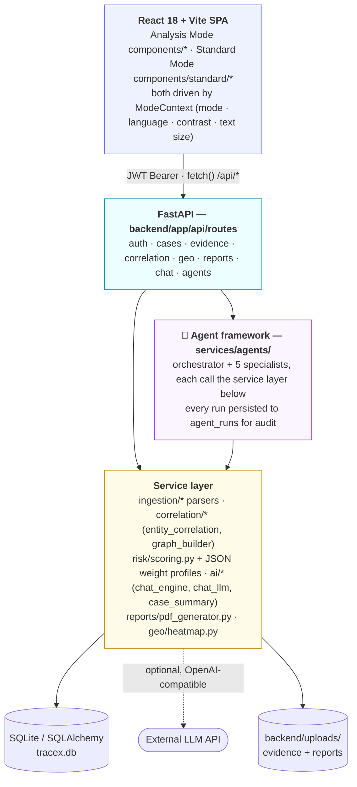

<br/>

## 🗄 Data model

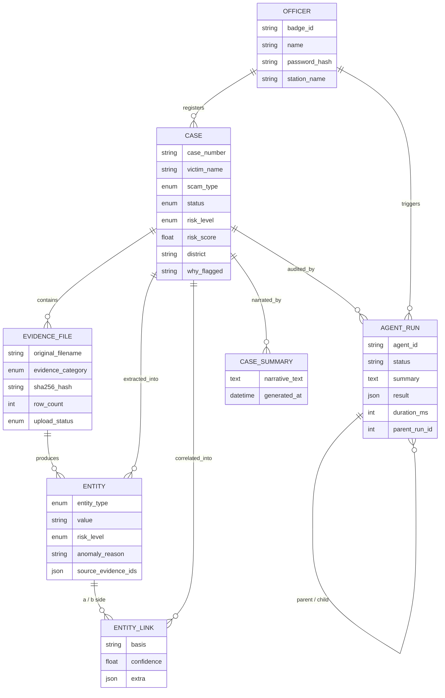

<br/>

## 🌐 One backend, two worlds

| | Analysis Mode | Standard Mode *(beta)* |
|---|---|---|
| **Look** | Dark SOC console, glow accents, glassmorphism | Light, formal e-governance portal |
| **Data layout** | Card- and graph-heavy | Dense, sortable registers/tables |
| **Header** | Live status bar, AI chat launcher | Emblem, department name, "Government of [X]" bar |
| **Navigation** | Icon tabs | Breadcrumbs + top navbar |
| **AI Agents** | Neon control room, animated pipeline | Formal register, same six agents |
| **Accessibility** | — | Text-size control, high-contrast toggle, bilingual (EN/HI) |
| **Auth extras** | — | Forgot Password → routes to admin |
| **Footer** | — | Statutory references, helplines, disclaimer |
| **Backing data** | Same `/api/*` endpoints | Same `/api/*` endpoints |

Switch anytime from the toggle in the top bar — the choice is remembered per browser
(`localStorage`), and nothing about a case changes when you do.

<br/>

---

## 🧰 Tech stack

<table>
<tr><td valign="top" width="50%">

**Backend**
- **FastAPI** + **Uvicorn** — async REST API
- **SQLAlchemy** — ORM (SQLite by default, swappable via `DATABASE_URL`)
- **Pydantic v2** — request/response schemas & settings
- **python-jose** + **passlib[bcrypt]** — JWT auth, hashed passwords
- **pandas / openpyxl** — CDR & bank/UPI spreadsheet parsing
- **ReportLab** (+ optional **WeasyPrint**) — PDF report generation
- **httpx** — outbound calls to an OpenAI-compatible LLM endpoint
- **pytest** — 49 tests across auth, agents, correlation, risk, reports, geo, chat, ingestion

</td><td valign="top" width="50%">

**Frontend**
- **React 18** + **React Router 6**
- **Vite 5** — dev server & build (Cloudflare Quick Tunnel-friendly)
- **Tailwind CSS 3** — design-token-driven theming for *both* UI modes
- **lucide-react** — icon set
- Hand-rolled **SVG force-graph** — zero graph-charting dependency
- `ModeContext` — mode / language / contrast / font-scale state, synced to `<html data-mode>`

</td></tr>
</table>

<br/>

## 🚀 Getting started

### Prerequisites

- Python 3.11+
- Node.js 18+

### Backend

```bash
cd backend
python -m venv venv && source venv/bin/activate   # Windows: venv\Scripts\activate
pip install -r requirements.txt
cp .env.example .env
uvicorn app.main:app --reload
```

The API starts at `http://localhost:8000`. On first launch it auto-seeds one officer
(`MP-IO-4471` / `demo1234`) and four fully-correlated demo cases spanning every scam type and risk tier.

<details>
<summary><b>Enable the AI layer (optional)</b></summary>

<br/>

Everything works fully offline out of the box. To let an LLM phrase the chat assistant's answers and
case narratives (using the same grounded case data — it never invents facts), set in `backend/.env`:

```env
AI_SUMMARY_API_KEY=sk-...
AI_SUMMARY_API_URL=https://api.openai.com/v1/chat/completions
AI_SUMMARY_MODEL=gpt-4o-mini
AI_CHAT_TIMEOUT_SECONDS=15
```

Any OpenAI-compatible chat-completions endpoint works. If the call is slow, rate-limited or
unreachable, the assistant transparently falls back to its data-driven answer.

</details>

### Frontend

```bash
cd frontend
cp .env.example .env
npm install
npm run dev
```

Open `http://localhost:5173` and sign in with the seeded credentials above.

<br/>

## 🎬 Run your own 5-minute demo

1. **Home** — see the live priority queue: urgent-action banner, four seeded cases ranked by risk
   score, the evidence pipeline, and the jurisdictional heatmap.
2. **+ New investigation** — enter a victim name, pick **Digital Scam**, and upload the sample evidence
   from `backend/data/sample/`: `mock_cdr.csv` → Telecom, `mock_bank_upi.xlsx` → Bank/UPI,
   `mock_apk_dump.json` + `mock_email.eml` → Other. Watch each file hash, parse and index live.
3. **Find connections & view graph** — correlation and scam-type-aware risk scoring run automatically;
   you land on the interactive graph. Filter by hop distance, inspect a cluster, read the AI narrative.
4. **AI Agents** — open the new tab and click **Run Full Auto-Pilot**. Watch all five specialists run
   in sequence, then expand any one for its full findings and recommendations.
5. **Reports** — generate the encrypted **Investigative Brief** and **Takedown Notice** PDFs, each
   stamped with a verifiable SHA-256.
6. Flip the **Standard / Analysis** toggle in the top bar at any point — same case, new skin.

<br/>

---

## 🔌 API reference

All routes below are mounted under `/api` and (except `/api/auth/login`) require
`Authorization: Bearer <JWT>`.

<details>
<summary><b>Expand full endpoint list</b></summary>

<br/>

| Method | Endpoint | Purpose |
|---|---|---|
| `POST` | `/auth/login` | Authenticate with badge ID + password → JWT |
| `GET` | `/auth/me` | Current officer profile |
| `POST` | `/cases` | Register a new case |
| `GET` | `/cases` | List all cases (risk-ranked) |
| `GET` | `/cases/{id}` | Full case detail |
| `GET` | `/cases/summary-stats` | Dashboard counters (high-risk, active, awaiting, closed) |
| `POST` | `/cases/{id}/evidence` | Upload an evidence file (multipart) |
| `GET` | `/cases/{id}/evidence` | List a case's evidence files |
| `GET` | `/evidence/unprocessed` | Global evidence-processing tray |
| `POST` | `/cases/{id}/correlate` | Run entity correlation + risk scoring |
| `GET` | `/cases/{id}/graph` | Node/edge graph for the correlation view |
| `GET` | `/cases/{id}/entities/top-risk` | Highest-risk entities for a case |
| `GET` | `/cases/{id}/summary` | Latest AI/deterministic case narrative |
| `POST` | `/cases/{id}/summary/regenerate` | Force-regenerate the narrative |
| `GET` | `/geo/heatmap` | District-wise fraud density |
| `POST` | `/cases/{id}/reports/investigative-brief` | Generate the encrypted Brief PDF |
| `POST` | `/cases/{id}/reports/takedown-request` | Generate the encrypted Takedown Notice PDF |
| `GET` | `/cases/{id}/reports/takedown-matches` | Threat-intel matches feeding the takedown notice |
| `GET` | `/cases/{id}/reports/preview` | Report data preview (no PDF render) |
| `POST` | `/chat` | Ask the grounded chat assistant (case-scoped or portfolio-wide) |
| `GET` | `/agents` | Catalogue of all 6 AI agents (id, name, role, description) |
| `POST` | `/cases/{id}/agents/{agent_id}/run` | Run one agent (or `case_orchestrator` for the full pipeline) |
| `GET` | `/cases/{id}/agents/runs` | Full audit trail of agent runs for a case |

</details>

<br/>

## 📁 Project layout

```
tracex/
├── backend/
│   ├── app/
│   │   ├── api/routes/        # auth · cases · evidence · correlation · geo · reports · chat · agents
│   │   ├── services/
│   │   │   ├── ingestion/     # telecom · bank/UPI · email · APK parsers + router
│   │   │   ├── correlation/   # entity_correlation.py · graph_builder.py
│   │   │   ├── risk/          # scoring.py + per-scam-type weight profiles (JSON)
│   │   │   ├── geo/           # district heatmap + offline IFSC/PIN lookups
│   │   │   ├── ai/            # chat_engine · chat_llm · case_summary
│   │   │   ├── agents/        # orchestrator + 5 specialist agents, registry, base framework
│   │   │   └── reports/       # pdf_generator.py (Brief + Takedown Notice)
│   │   ├── db/                # models.py (incl. AgentRun) · seed.py · seed_demo.py
│   │   └── core/               # config (Settings) · security (JWT/bcrypt)
│   ├── data/
│   │   ├── sample/            # demo evidence files used by the walkthrough
│   │   └── threat_intel/      # bundled known-bad-URL / known-APK-hash CSVs
│   └── tests/                  # 49 pytest tests
└── frontend/
    └── src/
        ├── components/        # Analysis Mode UI
        │   └── standard/      # Standard Mode UI (parallel component tree)
        ├── pages/              # Home · ConnectionsGraph · Reports · Agents · Login
        ├── hooks/              # useAgents.js — shared agent data/actions for both UIs
        ├── context/            # ModeContext (mode/theme/a11y state)
        ├── config/             # Standard Mode copy & placeholder identity
        └── styles/             # tokens.css (Analysis) · standard-mode.css
```

<br/>

## ✅ Testing

```bash
cd backend
pytest -q
```

49 tests cover authentication, the AI agent pipeline (including halt-on-integrity-failure and full audit
trail), entity correlation (including cross-case linking), risk-profile scoring, evidence ingestion, PDF
report generation, geo heatmap resolution, and the chat assistant's intent routing and LLM fallback
behaviour.

<br/>

## 🔒 Security notes

- Passwords are **bcrypt-hashed**; sessions are stateless **JWTs** (`JWT_SECRET`, configurable expiry).
- Every uploaded filename is sanitised against path traversal before it touches disk.
- Every evidence file and every generated report PDF is **SHA-256 hashed** for chain-of-custody
  integrity — verify what a court receives against what was actually ingested.
- The bundled chat/LLM system prompt is explicitly instructed to treat evidence content as **data,
  never as instructions**, and to answer only from supplied case context.
- Set a strong `JWT_SECRET` before any non-local deployment — the shipped default is for local dev only.

<br/>

---

## 🧭 Roadmap

- [ ] Postgres-first deployment profile for managed hosting
- [ ] Scheduled agent sweeps across the full case portfolio (today, every run is officer-triggered)
- [ ] Richer courtroom timeline export
- [ ] Role-based access beyond a single officer table
- [ ] Multi-tenant support for more than one cyber cell

<br/>

## 👥 Contributors

<a href="https://github.com/Krishnaa-21/tracex/graphs/contributors">
  
</a>

<br/><br/>

## 📄 License

[MIT](LICENSE) © 2026 Krishna Prajapat

<div align="center">
<sub>TraceX is an investigative decision-support tool. Risk scores, correlation links and AI-generated
narratives are advisory — the Investigating Officer verifies and decides.</sub>

<br/><br/>


</div>
